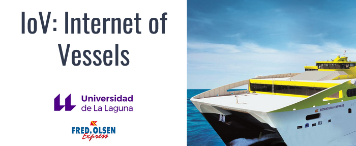

# TFG: IoV Internet of Vessels

- **Autor:** Francisco Javier Arocas Herrera
- **Tutor:** Manuel Rodríguez Valido
- **CoTutor:** David Falcón Molina

Repositorio sobre mi trabajo de fin de grado **IoV: Internet of Vessels**, para la Universidad de La Laguna en colaboración con la empresa Fred Olsen S.A.

El trabajo consiste en el diseño e implementación de una arquitectura para la toma de datos a través de sensores (Velocidad, aceleración, humedad, etc.), y el almacenamiento y tratamiento de estos.

Se presentó el día *21 de marzo de 2022* en la universidad de la laguna.

---

# Descripción

El proyecto abarca todos los puntos. Desde la toma de datos hasta el tratamiento de estos:

1. **Obtención de los datos:** Mediante el uso de diferentes sensores acoplados a Raspberries PI. Entre ellos destaca el *SenseHat*. Para ello se ha utilizado el lenguaje de programación Python.
2. **Envío de datos:** Con el uso del protocolo *MQTT* (Uno de los principales protocolos IoT). Se explica la instalación del broker HiveMQ, y como enviar mensajes MQTT mediante python.
3. **Almacenamiento de datos:** Utilizando una base de datos *InfluxDB*. 
4. **Tratamiento de datos:** Un posible caso de uso para los datos almacenados. En este caso, la posibilidad de calcular el índice de mareo. Es decir, el porcentaje de personas que han tenido algún tipo de molestia por mareo.

También se añade una posible implementación real de la arquitectura.

---

Dentro del repositorio **src**, se encuentra todo el código creado para la aplicación.
